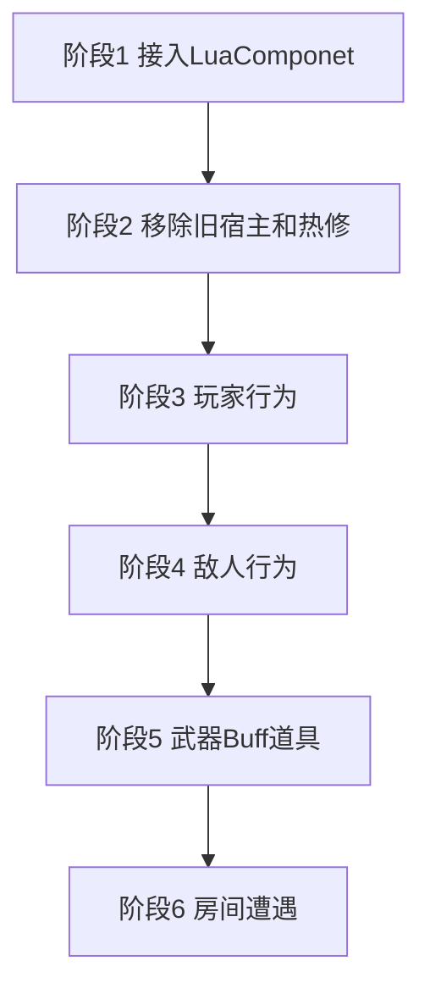

# Lua 玩法重写计划

玩法、界面、玩家行为和敌人行为都使用 [TCGGameDem0 的 `Lua` 分支](https://github.com/AChen1111/TCGGameDem0/tree/Lua)。入口类是 `LuaComponet`。要跑 Lua 的物体必须在预制体或场景上挂这个组件。

原来的 Lua 宿主全部移除，包括 Buff 的 `LuaFile` / `LuaBuffInstance` / `IBuffScriptInstance` / `BuffScriptRuntime`，道具的 `LuaManager.InvokeItemEffectMethod`，以及 xLua Hotfix、`hotfix/main` 和方法注入。不保留两套脚本入口。

C# 继续持有对象池、刚体、动画组件、属性公式、存档、Addressables 和房间门控。这些类向 Lua 提供方法，不再在内部实现玩法分支。

## 顺序

1. 接入 `LuaComponet`，补上玩家和敌人需要的逐帧回调与时间源。场景里放框架自己的 `LuaManager`。
2. 删除旧 Lua 宿主和热修入口。Buff、道具不再走返回 table 再由 C# 按 `OnAdd` / `OnPick` 调用的那条链路。
3. 玩家行为迁到玩家预制体上的 `LuaComponet`。
4. 敌人行为迁到各敌人预制体上的 `LuaComponet`。
5. 武器开火、Buff 特殊行为、道具效果改为各自预制体上的 Lua 模块。
6. 房间遭遇规则迁到房间物体上的 `LuaComponet`。

阶段 3 完成前，敌人仍使用现有 C# FSM。阶段 4 完成前，不把清波规则改成 Lua。武器脚本在玩家输入已经从 Lua 发出之后再迁，避免 C# 和 Lua 各处理一次射击。

## LuaComponet

框架代码来自 `Assets/Scripts/LuaComponet` 与 `Assets/Scripts/LuaRaw`。类名是 `LuaComponet`。

挂载规则：

- 玩家、敌人、武器、Buff 运行时物体、道具、房间、界面，只要行为在 Lua 里，预制体或场景物体上就必须有 `LuaComponet`。
- 没有这个组件就不会创建模块实例，也收不到生命周期。
- 不在运行时 `AddComponent` 补挂，也不为了挂脚本去 `new GameObject`。管理器、玩家、敌人、武器、界面都先放在场景或预制体上。
- `m_typeName` 在预制体里配置，并写进 `Assets/Scripts/LuaRaw/module.lua` 的 `moduleList`。`Awake` 时按这个名字建实例。模块不存在时初始化失败并报错。类型名不在运行时改，因此一种行为对应一个已经配好组件的预制体。

组件现有行为：

- `Main.Init` 创建实例表，写入 `table.gameObject`，元表指向模块。
- `ObjectReference` 按 `name` 注入场景引用，`DataReference` 按 `name` 注入 `Int`、`Float`、`String`、`Bool`。注入发生在 Lua `Awake` 之前。Lua 字段名必须和 Inspector 的 `name` 一致。
- 已转发的生命周期是 `Awake`、`Start`、`OnEnable`、`OnDisable`、`OnDestroy`。模块没有对应函数时跳过。
- 其他方法用 `CallLuaFunction`，第一个参数是实例表。
- `require` 只写文件名。`Assets/Scripts/LuaRaw/UI/BaseUI.lua` 对应 `require("BaseUI")`。编辑器读 `Assets/Scripts/LuaRaw` 源码；真机读 `Resources/LuaBundle.bytes`，打包入口是 `Tools/Lua/Build LuaBundle`。

接入这套框架时要补的生命周期：

- 当前组件没有 `Update` 和 `FixedUpdate`。玩家移动、敌人 FSM、Buff 间隔都依赖逐帧回调，因此在 `LuaComponet` 上增加这两次转发，仍然由组件调用 Lua，不另写一套脚本宿主。
- 增加时间源。玩家、武器、界面使用普通 `deltaTime`。敌人使用 `GameplayTime.EnemyDeltaTime`。敌人模块不读取 `Time.deltaTime` 或 `Time.timeScale`。
- 对象池复用不会再次调用 `Awake` 和 `Start`。取出和回收时由池调用 `OnEnable` / `OnDisable`，或显式 `CallLuaFunction("OnSpawn")` 与 `CallLuaFunction("OnRecycle")`。Lua 在回收时清掉计时、目标和攻击标记。

框架自己的 `LuaManager` 是 `PersistentMonoSingleton<LuaManager>`，负责创建 `LuaEnv`、执行 `require 'Main'`，并给 `LuaComponet` 提供 `GetLuaTable`。它放在 `Root` 场景里，执行顺序早于所有 `LuaComponet.Awake`。不走 `Instance` 为空时 `new GameObject` 再 `AddComponent` 的路径。

当前工程里的 `Game.Gameplay.LuaManager` 只服务旧 Buff 表、道具方法和 `hotfix/main`。旧宿主删除后，这个类一并删除，全工程只留框架这一个 Lua 环境。`Game.Gameplay` 不引用 `XLua.Runtime`，玩法类只调用 `LuaComponet.CallLuaFunction`，不持有 `LuaTable`。

## 要删除的旧框架

| 现有入口 | 处理 |
| --- | --- |
| `Buff.LuaFile`、`LuaBuffInstance`、`IBuffScriptInstance`、`BuffScriptRuntime` | 删除。不再转发 `OnAdd`、`OnRemove`、`OnUpdate`、`OnInterval`、`OnTrigger` |
| `Assets/Scripts/Gameplay/Buffs/Buff/*.lua.txt` | 改写成 `LuaRaw` 模块后删除原文件 |
| `LuaEffect` 与 `LuaManager.InvokeItemEffectMethod` | 删除这条调用。道具效果改为挂 `LuaComponet` 的预制体 |
| `Game.Gameplay.LuaManager` 的 Buff 缓存、道具缓存、热修 loader | 与该类一起删除 |
| `PgunHotfixConfig`、`StartupHotfixRuntime`、`hotfix/main`、`player_bullet_reverse` | 删除。不执行 `XLua/Hotfix Inject In Editor` |

`BuffManager` 的添加、移除、层数、持续时间和 `CalculateStat` 仍留在 C#。公式保持 `Final = (Base + FlatSum) * (1 + PercentAddSum) * FinalMulProduct`。Lua 不直接改玩家移速、攻击、最大生命。`Defense` 在伤害减免规则确定前不接入 `Player.Hurt`。

带特殊行为的 Buff 使用独立预制体，预制体上挂 `LuaComponet`，`m_typeName` 配成该 Buff 模块。`BuffManager` 添加时从对象池取出这个预制体，移除时回收。纯属性 Buff 只有 `StatModifier`，不配行为预制体。`SpeedBuff`、`DamageUpBuff`、`MaxHpUpBuff` 属于这一类，不把数值写进 Lua。`PoisonBuff`、`HaHaBuff` 改成行为预制体上的模块：间隔伤害仍调用 `Player.Hurt`，表现仍调用现有头顶消息，计时使用组件传入的 `deltaTime`。

## 阶段 3：玩家行为

玩家预制体挂 `LuaComponet`，`m_typeName` 为玩家模块。`ObjectReference` 注入刚体、动画、武器挂点、子弹时间所需的现有组件。

迁入 Lua 的行为：

- 移动和睡眠动画切换。
- 自动瞄准与鼠标瞄准。瞄准前仍查询 `GameplayCursorState.BlocksMouseCombat`。
- 射击、抬起、换弹的输入分发。具体弹道由武器物体上的 Lua 模块执行，玩家模块只负责把方向传过去。
- 受击反馈、治疗提示以外的表现分支。

留在 C# `Player` 上的部分：

- 当前生命、治疗、死亡和 `Hurt(DamageInfo)` 的数值入口。Lua 需要造成伤害或治疗时调用这些方法。
- 武器地址装载：`weapon/pistol`、`weapon/ak`、`weapon/awp`、`weapon/bow`、`weapon/laser`、`weapon/mp5`、`weapon/rocket_gun`、`weapon/shotgun`。装载完成前不把射击输入交给 Lua。
- `PlayerRegistry.Current`、读档恢复用的字段。
- `BuffManager` 引用。属性变化继续走 `CalculateStat`。

玩家逐帧逻辑只存在于 Lua 的 `Update`。C# `Player.Update` 不再写移动和射击。

## 阶段 4：敌人行为

每个敌人预制体挂 `LuaComponet`。追击、攻击窗口、弹幕形状写在对应模块里。`EnemyBase` 保留血量、受击闪白、死亡回收、掉落、`FightRoom.NotifyEnemyDefeated`、动画参数和对象池重置。

| 敌人 | 迁入 Lua 的行为 |
| --- | --- |
| `EnemyA` | 追击 `followDuration` 后攻击，攻击窗内按 `shootInterval` 向玩家发射 |
| `EnemyBat` | 追击后停步，延迟 `attackShootDelay` 发射扇形弹，再锁定到 `attackLockDuration` |
| `EnemyMelee` | 读取预制体上的 `MeleeAttackDetector`，命中后进入攻击窗，冷却为 `attackCooldown` |
| `EnemyBig` | 环形弹幕和追踪点射交替，持续时间和子弹数量沿用预制体上的现有数值 |

C# 向 Lua 提供移动、停止、翻转、播放攻击动画、从 `EnemyBulletPool` 生成子弹。近战检测器留在预制体上，作为 `ObjectReference` 注入。`EnemyDatabase` 继续提供生命、移速、伤害和掉落概率，`ApplyConfig` 留在 C#。

迁移顺序是 `EnemyA`、`EnemyBat`、`EnemyMelee`、`EnemyBig`。预制体上的旧时长字段保留到该模块核对手感之后再删。

完成标准：子弹时间只拖慢敌人移动、攻击计时、敌人子弹和敌人动画。死亡仍通知房间。对象池复用后不保留上一只敌人的计时和房间引用。

## 阶段 5：武器、Buff、道具

这三类都不再新增 C# 行为子类，也不再新增旧式 Lua table 宿主。每种需要特殊规则的内容是一个挂了 `LuaComponet` 的预制体。

### 武器

`Gun` 继续负责读 `WeaponDatabase`、弹夹、备弹、换弹、音效、开火点和 `PlayerBulletPool`。弹道规则在武器预制体的 Lua 模块里。玩家 Lua 在按下、按住、抬起时 `CallLuaFunction` 到当前武器的 `LuaComponet`。

| 枪 | 模块里的规则 | 批次 |
| --- | --- | --- |
| `ShotGun` | 一次发射 5 发，左右按 2 度展开 | 第一批 |
| `Laser` | 开关 `LineRenderer`，射线检测 `Wall` 与 `EnemyLayer`，按间隔对 `EnemyBase.Hurt`；无限备弹 | 第一批 |
| `Bow` | 按住超过 0.5 秒才显示箭矢并在抬起时发射；无限备弹 | 第一批 |
| `RocketGun` | 单发节流，子弹朝向为瞄准方向 | 第一批 |
| `AWP` | 单发节流 | 第一批最后，用来确认没有额外弹道的枪也能挂模块 |
| `AK` | 按住循环音效，按间隔发射，抬起播放结束音 | 第二批 |
| `MP5` | 与 AK 相同，抬起停止音效 | 第二批 |
| `Pistol` | 按下打一发 | 第二批 |

激光的 `LineRenderer`、弓的箭矢 `SpriteRenderer` 继续在预制体上，通过 `ObjectReference` 注入。散射角度、激光距离、蓄力 0.5 秒写在对应模块里。伤害、射速、弹速仍来自 `WeaponData`。

### Buff

见上文「要删除的旧框架」。新的间隔伤害和触发表现只加行为预制体与 `LuaRaw` 模块。状态栏仍读 `BuffManager.ActiveBuffs`，不在 Lua 里另存一份显示数据。

### 道具

世界道具预制体挂 `LuaComponet`。背包不保存场景物体，只保存物品 id 和效果预制体对应的模块。使用时从对象池取出效果预制体，调用 `CanUse` 和 `OnPick`，然后回收。`CanUse` 缺失时不允许使用，并报错，避免把旧的默认 `true` 再做成一套隐式规则。

| 效果 | 模块规则 |
| --- | --- |
| 宝箱 | 有 `ItemSpawner` 且掉落表非空才可使用；生成仍调用 `ItemSpawner`，不在 Lua 里 `Instantiate` |
| 净化 | 存在 `BuffTag.Negative` 才可使用；调用 `RemoveBuffsByTag` |
| 施加 Buff | 能解析 `buffId` 且玩家有 `BuffManager` 才可使用；调用 `AddBuff` |
| 治疗 | `Player.IsHPFull` 时不可使用；否则 `Player.Heal`，并用现有头顶消息显示实际治疗量 |

治疗量、BuffId、是否显示消息放在效果预制体的 `DataReference` 里。背包堆叠、拾取动画、对象池释放和 `ItemEvents.InventoryChanged` 留在 C#。

## 阶段 6：房间

房间物体挂 `LuaComponet` 后，只把额外遭遇规则放进模块。`FightRoom` 继续持有波数、敌人数、门和 `currentFightRoom`。`NormalRoom` 的敌人数量仍由 `EnemySpawnTableSO` 决定。Edgar 生成和 `AddressableDungeonBootstrapper` 留在 C#。

| 房间 | 处理 |
| --- | --- |
| `NormalRoom` | 生成表保持 ScriptableObject。额外波次规则才进 Lua |
| `ChestRoom` | 进入时在点位生成物品的规则进 Lua。完成标记和读档字段留在房间组件 |
| 清房奖励 | `OnFightAllWavesEnd` 转发给房间模块。生成仍调用 `ItemSpawner` |
| `InitRoom`、`FinalRoom`、`SaveRoom` | 出生点、最终房间贴图、安全点存档不进 Lua |

战斗中 `currentFightRoom` 非空时存档仍然失败。已清空房间读档后不再刷怪，也不再次结算掉落。波数 UI 仍只消费 `RoomWaveDisplayEvent`。

## 留在 C# 的部分

- 对象池的创建、预热和 `IPoolable` 重置。Lua 只收到取出和回收回调。
- `AddressableLoader`、`DataBaseManager`、存档读写。安全点禁止战斗中存档。
- `GameplayTime` 的敌人时间倍率。它不改 `Time.timeScale`。
- 伤害数字、DOTween、小地图、镜头。
- `UIStackManager` 的压栈、暂停和 `GameplayCursorState`。界面模块挂在面板根物体的 `LuaComponet` 上，按钮和文本用 `ObjectReference` 注入。改成 Lua 的面板不再并行维护 `ComponentAutoBindTool` 绑定；仍由 C# 驱动的面板可以继续用自动绑定。
- 玩家生命入口、敌人死亡结算、武器弹药、Buff 属性公式。

## 共同约束

- 新 C# 使用中文注释，注释为中文描述加英文标点。
- 缺少 `LuaManager`、`LuaComponet`、模块名、数据库或预制体引用时直接报错。
- 不在代码里创建管理器物体。框架 `LuaManager` 只放在 `Root`。
- 新 Lua 文件放在 `Assets/Scripts/LuaRaw` 下按玩家、敌人、武器、Buff、道具、房间、UI 分子目录。`require` 仍只用文件名，因此文件名不能重复。
- 需要热更新的 Lua 文本进入对应 Addressables 分组并带 `hot_update`。分组仍是 `Buff`、`Item`、`Weapon`、`Enemy`、`Room`。不再使用 `Hotfix` 分组承载 `xlua.hotfix`。
- 接入这套框架后，把 `LuaComponet` 的职责、目录和「物体必须挂组件」写进 `SKILL.md` 与 `references/project-architecture.md`。

## 验收

1. 工程里不再存在 `LuaBuffInstance`、`BuffScriptRuntime`、道具 `InvokeItemEffectMethod` 和 `hotfix/main` 执行路径。
2. 玩家预制体在未挂 `LuaComponet` 时启动失败；挂上之后，移动、瞄准和射击输入只由 Lua 模块执行。
3. 四类敌人预制体都挂有 `LuaComponet`。子弹时间下追击和攻击变慢，回收后状态被清空，清波计数仍然正确。
4. 纯属性 Buff 只改表。中毒和触发表现来自挂了 `LuaComponet` 的 Buff 预制体，属性仍由 `CalculateStat` 结算。
5. 治疗、净化、施加 Buff、宝箱的消耗条件与迁移前一致，效果物体来自对象池。
6. 散弹、激光、弓、火箭筒的弹数、角度、蓄力时间和射线层与迁移前一致。
7. 战斗中安全点存档失败。已清空房间读档后不再刷怪。
