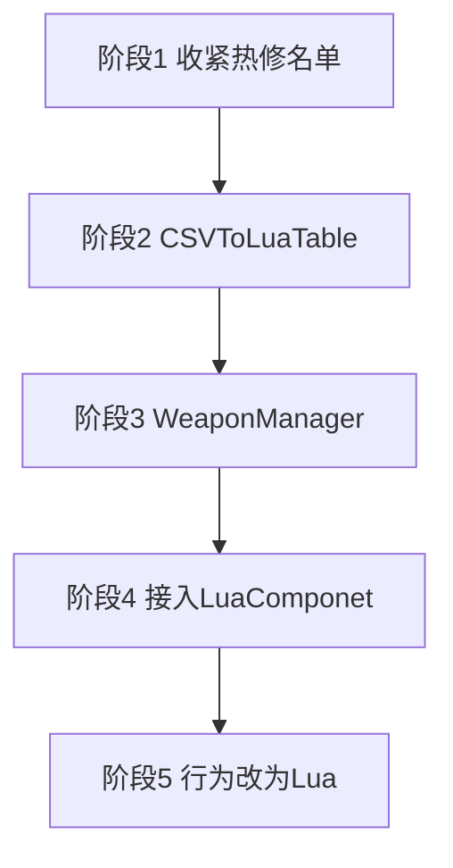

# Lua 玩法重写计划

这是三份计划里的第一份。执行顺序是本计划、[随机房间生成方案](random-room-generation-plan.md)、[敌人行为重写方案](enemy-navigation-plan.md)。本计划留下的接口要能直接被后面两份使用。

玩家和敌人的逐帧逻辑留在普通 C#，不把 `Update` / `FixedUpdate` 改写成 Lua。敌人怎么追、怎么绕墙，不在本计划里保留旧的直线追击，而由第三份计划的 `EnemyBrain` 替换。本计划只保证敌人发射走 `WeaponManager`，数值走 Lua 表。

武器、Buff 特殊行为、道具、房间遭遇和界面改用 [TCGGameDem0 的 `Lua` 分支](https://github.com/AChen1111/TCGGameDem0/tree/Lua)。入口类是 `LuaComponet`。要跑这些 Lua 的物体必须在预制体或场景上挂这个组件。

不把玩家或敌人的 `Update` / `FixedUpdate` 改写成 Lua，也不要用 `xlua.hotfix` 替换这两个方法。xLua 的 `[Hotfix]` 按类型注入，标了 `Player` 或 `EnemyBase` 之后，`Update` 也会被注入一次空判断；补丁本身只改 `Hurt`、`Dead`、瞄准修正、单次攻击这种短方法。整段换掉 `Update` 会把移动、子弹时间和对象池重置一起换掉。

对象池留在 C#。旧的 Buff / 道具 Lua 宿主删除，不和 `LuaComponet` 并存。玩法数值不再用 ScriptableObject 配置，改为 CSV 生成 Lua table。

## 顺序

1. 收紧 `Assets/XLua/Editor/PgunHotfixConfig.cs`，只保留玩家和敌人。枪械、子弹移出热修名单。执行 `XLua/Generate Code` 和 `XLua/Hotfix Inject In Editor`。
2. 做 `CSVToLuaTable`。玩家、武器、子弹、Buff、敌人、道具和生成表的配置都变成 Lua table。
3. 在游戏场景放 `WeaponManager`，作为玩家和敌人取得枪械、生成子弹的唯一入口。
4. 接入 `LuaComponet` 和框架 `LuaManager`。不给这个组件加 Unity `Update` / `FixedUpdate`。
5. 删除旧 Buff / 道具 Lua 宿主，并停用 `ItemDatabase`、`WeaponDatabase`、`BuffDataBase`、`EnemyDatabase` 这些数值配置。枪械开火和子弹命中规则改为挂 `LuaComponet` 的预制体。
6. Buff 特殊行为、道具、房间遭遇和界面面板改为 `LuaComponet`。

## 玩家和敌人留在 C#

`Player.Update` 继续负责移动、睡眠动画、自动瞄准、鼠标瞄准和射击输入。瞄准前仍查询 `GameplayCursorState.BlocksMouseCombat`。生命、治疗、`Hurt(DamageInfo)`、`PlayerRegistry` 和读档字段留在 `Player`。玩家不直接访问 `PlayerBulletPool`，也不在自己的脚本里查找具体枪。当前枪和发射都通过 `WeaponManager`。

`EnemyBase` 继续负责血量、受击、死亡、掉落、`FightRoom.NotifyEnemyDefeated`、动画参数、`GameplayTime.EnemyDeltaTime` 和对象池重置。本计划不修改 `FollowPlayerWithBodySpace`，也不要给这条即将删除的直线追击加补丁。第三份计划会删掉它，改由 `EnemyBrain` 写速度。

敌人生成子弹只调用 `WeaponManager.SpawnEnemyBullet`，参数包含预制体、位置、方向、伤害。方向由调用方传入，不在管理器里再指向玩家坐标。这样第三份计划可以在有视线时沿瞄准方向发射，没有视线时不发射。

热修名单在本计划只保留这些类型：

| 类型 | 原因 |
| --- | --- |
| `Player` | 移动、瞄准、受击 |
| `EnemyBase` | 受击、死亡、掉落、池重置 |

`EnemyA`、`EnemyBat`、`EnemyMelee`、`EnemyBig` 先移出热修名单。它们的走位会在第三份计划删除。`EnemyBrain` 落地后再加入热修名单。

`PlayerBullet`、`EnemyBullet`、`Gun` 及其子类、`BuffManager`、房间、存档、道具、背包不进入热修名单。枪械和子弹规则走 `LuaComponet`。

`Assets/Scripts/Gameplay/Lua/Hotfix/MainHotfix.lua.txt` 仍然是地址 `hotfix/main` 的启动入口。默认不 `require` 示例补丁。`player_bullet_reverse` 只作注入是否生效的例子，不作为正式逻辑。真正的补丁按 `require("hotfix.xxx")` 加进入口，并放在 `Hotfix` 分组，标签含 `hotfix` 与 `hot_update`。

改完名单后执行 `XLua/Generate Code`，等编译结束，再执行 `XLua/Hotfix Inject In Editor`。只新增普通 Lua 文本时不必重新注入。

## CSVToLuaTable

玩法配置不再写入 ScriptableObject，也不再扩展 `Excel2SoListAssetImporter` 来生成 `ItemDatabase`、`WeaponDatabase`、`BuffDataBase`、`EnemyDatabase`。`DataBaseManager` 不再为这些数值加载 SO。预制体上的 `maxHp`、`moveSpeed` 等配置字段也不再作为数据来源。

编辑器工具放在 `Assets/UnityEasyWorkTools/TableImporter`，入口名为 `CSVToLuaTable`。它读 CSV 表头和数据行，写出 `Assets/Scripts/LuaRaw/Data` 下的 Lua 文件。文件 `return` 一张表。缺列、空 id、无法解析的数字直接让导入失败。

资源列只写 Addressables 地址字符串，例如图标、预制体、音效。运行时用 `AddressableLoader` 按地址加载，不在 Lua 表里保存 `Sprite`、`AudioClip` 或预制体对象。

| 生成文件 | 键 | 内容 |
| --- | --- | --- |
| `PlayerData.lua` | 单表 | `maxHp`、`moveSpeed`、子弹时间倍率、持续时间、冷却 |
| `WeaponData.lua` | `weaponId` | 伤害、弹夹、射速、弹速、音效地址 |
| `BulletData.lua` | 子弹 id | 存活时间、速度、伤害、命中 Buff id |
| `BuffData.lua` | `buffId` | 名称、描述、图标地址、正负面、持续时间、间隔、属性修正 |
| `EnemyData.lua` | `enemyId` | 预制体地址、生命、移速、伤害、掉落概率、视野半径、视野角度、追踪时间、分离半径、分离权重、攻击间隔和射程 |
| `ItemData.lua` | `itemId` | 名称、描述、图标地址 |
| `SpawnData.lua` | 房间或波次 id | 敌人波次、道具权重 |
| `LevelData.lua` | `levelId` | 房间总数、五类房间数量、房间预制体地址。供第二份计划读取 |

属性修正在 `BuffData` 里写成嵌套表，例如 `{ stat = "MaxHp", type = "PercentAdd", value = 0.2 }`。`BuffManager.CalculateStat` 仍用公式 `Final = (Base + FlatSum) * (1 + PercentAddSum) * FinalMulProduct`，输入来自这张表，不再来自 `StatModifier` 资源。Lua 不直接改玩家当前移速、攻击和生命。

`Game.Lua` 提供读取接口，例如按模块名和 id 取整行、按字段取数字和字符串。缺表、缺 id、缺字段时报错。`Game.Gameplay` 只调用这个接口，不持有 `LuaTable`。生成出的 Data Lua 带 `hot_update` 标签，和对应内容放进 `Buff`、`Item`、`Weapon`、`Enemy` 分组。

玩家当前生命、换弹剩余、敌人当前血量仍是运行时状态，留在 C# 和存档里。配置值从对应 Lua 表读。`Player.MaxHP` 的基础值使用 `PlayerData.maxHp`，再交给 `CalculateStat`。敌人生成时用 `EnemyData` 的生命、移速、伤害和视野参数，不再读 `EnemyDatabase`。枪械弹药上限和伤害从 `WeaponData` 读，不再调用 `WeaponDatabase.ApplyTo`。

`Assets/csv/LevelConfig.csv` 由 `CSVToLuaTable` 生成 `LevelData.lua`。运行时不要再写一套 CSV 解析。第二份计划只通过 Lua 数据接口按 `levelId` 取这一行。缺 `LevelData` 字段时和别的表一样直接失败。

安全点禁止战斗中存档这条规则保持不变。地图如何复现不在本计划里绑死 Edgar 的关卡图地址。第二份计划改为保存 `levelId` 和种子。

## LuaComponet

框架代码来自 `Assets/Scripts/LuaComponet` 与 `Assets/Scripts/LuaRaw`。类名是 `LuaComponet`。

挂载规则：

- 武器、子弹、Buff 行为物体、道具、房间、界面，只要规则在 Lua 里，预制体或场景物体上就必须有 `LuaComponet`。
- 玩家和敌人不挂这个组件。它们通过 `WeaponManager` 取枪和生成子弹。
- 没有这个组件就不会创建模块实例。不在运行时 `AddComponent` 补挂，也不为了挂脚本去 `new GameObject`。
- `m_typeName` 在预制体里配置，并写进 `module.lua` 的 `moduleList`。`Awake` 时按这个名字建实例。模块不存在时初始化失败并报错。类型名不在运行时改。

组件行为：

- `Main.Init` 创建实例表，写入 `table.gameObject`。
- `ObjectReference` 按 `name` 注入场景引用，`DataReference` 按 `name` 注入 `Int`、`Float`、`String`、`Bool`。注入发生在 Lua `Awake` 之前。
- 生命周期是 `Awake`、`Start`、`OnEnable`、`OnDisable`、`OnDestroy`。没有对应函数时跳过。
- 玩法事件用 `CallLuaFunction`。需要时间时，由调用方把 `deltaTime` 作为参数传入，例如武器按住时的 `Shooting(self, dir, deltaTime)`。组件自己不注册 Unity `Update` 或 `FixedUpdate`。
- `require` 只写文件名。编辑器读 `Assets/Scripts/LuaRaw`；真机读 `Resources/LuaBundle.bytes`，打包入口是 `Tools/Lua/Build LuaBundle`。

框架 `LuaManager` 放在 `Root`，执行顺序早于所有 `LuaComponet.Awake`。不在 `Instance` 为空时创建物体。当前 `Game.Gameplay.LuaManager` 在旧 Buff / 道具宿主删除后去掉，热修入口改由框架 `LuaManager` 在启动时执行 `hotfix/main`。`Game.Gameplay` 不引用 `XLua.Runtime`，不持有 `LuaTable`。

对象池保持 `IPoolable` 和 `PoolBase<T>`，包括 `PlayerBulletPool`、`EnemyBulletPool`、`EnemyPool`、`ItemPool`、`VfxPool`。`Get`、`Release`、`Prewarm` 不进入 Lua。池对象上若有 `LuaComponet`，由 C# 的 `OnSpawnFromPool` / `OnRecycleToPool` 再调用 `OnSpawn` / `OnRecycle`。`Awake` 和 `Start` 不会在复用时再次执行。

## 要删除的旧 Lua 宿主

| 现有入口 | 处理 |
| --- | --- |
| `Buff.LuaFile`、`LuaBuffInstance`、`IBuffScriptInstance`、`BuffScriptRuntime` | 删除 |
| `Assets/Scripts/Gameplay/Buffs/Buff/*.lua.txt` | 改写成 `LuaRaw` 模块后删除 |
| `LuaEffect` 与 `InvokeItemEffectMethod` | 删除。道具效果改为挂 `LuaComponet` 的预制体 |

`BuffManager` 继续负责添加、移除、层数、持续时间和 `CalculateStat`。公式保持 `Final = (Base + FlatSum) * (1 + PercentAddSum) * FinalMulProduct`。Lua 不直接改移速、攻击、最大生命。间隔到时由 `BuffManager` 调用行为物体上的 `OnInterval`，不让 Buff 物体自己 `Update`。

纯属性 Buff 只有 `BuffData` 里的修正表，不配行为预制体。`PoisonBuff`、`HaHaBuff` 使用挂了 `LuaComponet` 的预制体：伤害仍走 `Player.Hurt`，文本仍走现有头顶消息。间隔和持续时间从 `BuffData` 读。

## WeaponManager

`WeaponManager` 放在游戏场景里，和对象池、`WeaponGlobal` 一起摆放，不在代码里创建。它是玩家、敌人和 Lua 取得枪械或子弹的唯一中转。

| 调用方 | 能做的事 |
| --- | --- |
| `Player` | `GetCurrentGun`、`GetGun(weaponId)`、按输入把按下、按住、抬起转给当前枪的 `LuaComponet` |
| 敌人 | `SpawnEnemyBullet`，传入预制体、位置、方向、伤害。方向由 `EnemyBrain` 或攻击模块给出 |
| 枪械 Lua | `SpawnPlayerBullet`，传入预制体、开火点、方向、伤害、弹速 |
| 子弹 Lua | 不自己回池。命中或存活结束后调用 `WeaponManager` 回收 |

`WeaponManager` 内部才调用 `PlayerBulletPool`、`EnemyBulletPool` 和 `WeaponGlobal.PlayGunFire`。枪口火光和共用音源仍留在现有 `WeaponGlobal`。弹夹剩余、备弹剩余和换弹过程由枪械上的 C# 组件保存；弹夹容量、伤害、射速和弹速从 `WeaponData` 读入。Lua 通过 `WeaponManager` 拿到这把枪再读当前弹药。

玩家武器地址装载仍由 C# 完成：`weapon/pistol`、`weapon/ak`、`weapon/awp`、`weapon/bow`、`weapon/laser`、`weapon/mp5`、`weapon/rocket_gun`、`weapon/shotgun`。装载结果登记到 `WeaponManager`。装载完成前，`GetCurrentGun` 失败并报错，不发射。读档恢复的 `currentGunIndex` 也通过 `WeaponManager` 切回对应枪。

## 枪械和子弹

枪械预制体和子弹预制体都挂 `LuaComponet`。开火弹道、命中效果、存活规则写在模块里。

子弹上的 C# 只保留刚体速度写入和对象池重置：玩家子弹用普通 `deltaTime`，敌人子弹用 `GameplayTime.EnemyDeltaTime`。这一小段不进 Lua，避免每颗子弹都走 Lua `Update`。方向、速度、伤害、是否已命中由 Lua 在 `OnSpawn` 写入；碰到敌人、玩家或墙时，C# 调用该子弹的 `OnHit`。特殊弹道需要逐帧修正时，由这段 C# 把 `deltaTime` 传给 `OnMove`，仍然不给 `LuaComponet` 加 Unity `Update`。

`Player.Update` 在按下、按住、抬起时调用当前枪的 `LuaComponet`，按住时传入 `deltaTime`。弓的 0.5 秒蓄力留在枪械模块里。

### 武器

| 枪 | 模块规则 | 批次 |
| --- | --- | --- |
| `ShotGun` | 一次 5 发，左右按 2 度展开 | 第一批 |
| `Laser` | `LineRenderer` 与射线检测，按间隔 `Hurt`；无限备弹 | 第一批 |
| `Bow` | 按住超过 0.5 秒后抬起发射；无限备弹 | 第一批 |
| `RocketGun` | 单发节流 | 第一批 |
| `AWP` | 单发节流 | 第一批最后 |
| `AK`、`MP5` | 按住循环音效并按间隔发射 | 第二批 |
| `Pistol` | 按下打一发 | 第二批 |

具体枪的开火覆盖改到 Lua 后删除。`Gun` 基类只留弹药、开火点和读表，不进入热修名单。发射一律走 `WeaponManager.SpawnPlayerBullet`。

### 道具

世界道具和效果预制体挂 `LuaComponet`。背包只存物品 id。使用时从 C# 对象池取出效果预制体，调用 `CanUse` 和 `OnPick`，然后回收。`CanUse` 缺失时报错。

拾取侧：`Item` 移除了效果列表，`pickInBackBag=false` 的道具在拾取瞬间调用预制体 `LuaComponet` 的 `OnPickedUp`，`itemId` 与 `sourceObject` 由 C# 注入；入背包的道具挂了 `LuaComponet` 时同样转发，没挂则跳过。

掉落权重：`SpawnData.lua` 每张生成表带 `itemDrops` 列表（`itemId` 加 `weight`），CSV 用 `kind` 列区分敌人波次行和道具掉落行。`ItemSpawner` 按掉落表 id 读取权重、按 `ItemData` 的 `prefabAddress` 预载道具预制体，敌人死亡掉落与房间奖励共用这条链路，不再读 `ItemSpawnTableSO`。

| 效果 | 规则 |
| --- | --- |
| 宝箱 | 有生成器且掉落表非空才可使用；生成调用 `ItemSpawner` |
| 净化 | 存在负面 Buff 才可使用；调用 `RemoveBuffsByTag` |
| 施加 Buff | 能解析 `buffId` 才可使用；调用 `AddBuff` |
| 治疗 | 满血不可使用；否则 `Player.Heal` |

治疗量、BuffId 放在 `DataReference`。堆叠、拾取和 `ItemEvents.InventoryChanged` 留在 C#。

### 房间和界面

`FightRoom` 继续持有波数、敌人数、门和 `currentFightRoom`。清房奖励和 `ChestRoom` 的进入生成放到房间物体的 `LuaComponet`。`InitRoom`、`FinalRoom`、`SaveRoom` 的出生点、贴图和安全点不进 Lua。战斗中存档仍然失败。已清空房间读档后不再刷怪。

房间布局不在本计划里改，也不要把 Edgar 写成最终方案。第二份计划会换成带种子的随机游走。本计划的房间 Lua 只挂遭遇规则。房间预制体必须继续保留 `Floor`、`Walls` 和四个 `DoorAnchor`，供第二份计划摆走廊、第三份计划建可行走格。房内刷什么敌人仍读 `SpawnData`，不写进 `LevelData`。

`UIStackManager` 继续负责压栈、暂停和 `GameplayCursorState`。`UIPanelBase` 在栈流程生命周期后转发 `OnOpen` / `OnClose` / `OnPause` / `OnResume` 给面板根物体上可选的 `LuaComponet`，控件用 `ObjectReference` 注入，面板模块继承 `PanelBase`。主菜单已迁移为 `MainPanelModule`。

### UI 迁移边界

- `SettingsPanel` 保留 C#：分辨率枚举、AudioMixer 和本地设置存储是引擎胶水，与玩法规则无关，迁入 Lua 只有坏处。
- `HudPanel` 本身无逻辑，只有子元素（血条、波次、Buff 状态），子元素维持事件驱动的 C#。
- 其余面板按主菜单的同一模式逐个迁移：C# 面板与生成的 `BindComponent` 保留到预制体换绑完成后一起删除。

## 留在 C# 的部分

- 玩家逐帧逻辑，以及 `Player`、`EnemyBase` 的热修标记。敌人追击算法由第三份计划的 `EnemyBrain` 替换。
- `WeaponManager` 的查询、生成和回收转发。
- 子弹刚体速度写入。命中和存活规则在 Lua。
- 对象池。
- `BuffManager` 的容器和属性公式。
- `GameplayTime`。它不改 `Time.timeScale`。
- 存档、`AddressableLoader`。运行时数值不从 `DataBaseManager` 的 SO 读取。
- 伤害数字、DOTween、小地图、镜头。
- 房间门、波数计数、安全点禁止战斗中存档。房间之间怎么摆由第二份计划决定。

## 共同约束

- 新 C# 使用中文注释，注释为中文描述加英文标点。
- 缺少 `LuaManager`、`LuaComponet`、模块名或预制体引用时直接报错。
- 不在代码里创建管理器物体。`WeaponManager` 和框架 `LuaManager` 都放在场景里。
- 玩家、敌人和 Lua 模块不直接调用 `PlayerBulletPool` 或 `EnemyBulletPool`。
- 新 Lua 放在 `Assets/Scripts/LuaRaw`，按武器、子弹、Buff、道具、房间、UI、hotfix 分子目录。文件名不能重复。
- 内容脚本进入 `Buff`、`Item`、`Weapon`、`Room` 分组并带 `hot_update`。热修脚本进入 `Hotfix` 分组。
- 接入后把 `LuaComponet` 的挂载规则和热修名单写进 `SKILL.md` 与 `references/project-architecture.md`。

## 验收

1. 玩家最大生命从 `PlayerData` 读取，不读预制体上的 `maxHp`。武器伤害从 `WeaponData` 读取，敌人生命从 `EnemyData` 读取。缺字段时导入或运行直接失败。
2. 玩家移动、瞄准仍由 C# `Update` 执行。敌人逐帧逻辑仍在 C#，但本计划不保留直线追击。子弹时间只拖慢敌人侧，包括敌人子弹。
3. 玩家和敌人都不直接访问子弹池。生成和回收都经过场景里的 `WeaponManager`。
4. `PgunHotfixConfig` 只含玩家和敌人。`hotfix/main` 默认不改变射击方向。
5. 工程里不再存在 `LuaBuffInstance`、`BuffScriptRuntime` 和道具 `InvokeItemEffectMethod`。玩法数值不再从 `ItemDatabase`、`WeaponDatabase`、`BuffDataBase`、`EnemyDatabase` 读取。
6. 散弹、激光、弓、火箭筒的弹数、角度、蓄力时间和射线层与迁移前一致，并由武器上的 `LuaComponet` 执行。子弹命中效果由子弹上的 `LuaComponet` 执行。
7. 纯属性 Buff 只改 `BuffData`。中毒和触发表现来自 Buff 行为预制体，间隔由 `BuffManager` 调用。
8. 治疗、净化、施加 Buff、宝箱的消耗条件与迁移前一致，效果物体由 C# 对象池取出。
9. 战斗中安全点存档失败。已清空房间读档后不再刷怪。
