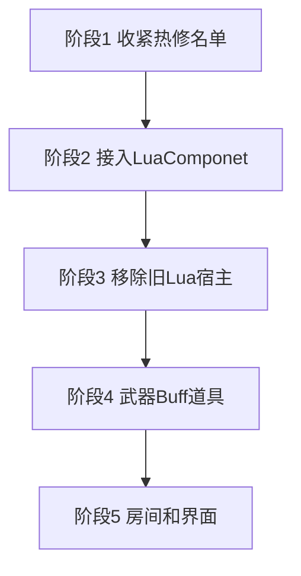

# Lua 玩法重写计划

玩家和敌人的逐帧逻辑留在普通 C#。这两类类型打上 xLua Hotfix 标记，只为已发布版本留补丁口。武器、Buff 特殊行为、道具、房间遭遇和界面改用 [TCGGameDem0 的 `Lua` 分支](https://github.com/AChen1111/TCGGameDem0/tree/Lua)。入口类是 `LuaComponet`。要跑这些 Lua 的物体必须在预制体或场景上挂这个组件。

不把玩家或敌人的 `Update` / `FixedUpdate` 改写成 Lua，也不要用 `xlua.hotfix` 替换这两个方法。xLua 的 `[Hotfix]` 按类型注入，标了 `Player` 或 `EnemyBase` 之后，`Update` 也会被注入一次空判断；补丁本身只改 `Hurt`、`Dead`、瞄准修正、单次攻击这种短方法。整段换掉 `Update` 会把移动、子弹时间和对象池重置一起换掉。

对象池留在 C#。旧的 Buff / 道具 Lua 宿主删除，不和 `LuaComponet` 并存。

## 顺序

1. 收紧 `Assets/XLua/Editor/PgunHotfixConfig.cs`，只保留玩家、玩家子弹、敌人、敌人子弹。执行 `XLua/Generate Code` 和 `XLua/Hotfix Inject In Editor`。
2. 接入 `LuaComponet` 和框架 `LuaManager`。不给这个组件加 Unity `Update` / `FixedUpdate`。
3. 删除旧 Buff / 道具 Lua 宿主。
4. 武器开火、Buff 特殊行为、道具效果改为挂 `LuaComponet` 的预制体。玩家 C# 在按下、按住、抬起时调用武器模块。
5. 房间额外遭遇和界面面板改为 `LuaComponet`。

## 玩家和敌人留在 C#

`Player.Update` 继续负责移动、睡眠动画、自动瞄准、鼠标瞄准和射击输入。瞄准前仍查询 `GameplayCursorState.BlocksMouseCombat`。生命、治疗、`Hurt(DamageInfo)`、武器地址装载、`PlayerRegistry` 和读档字段留在 `Player`。装载完成前不把射击交给武器 Lua。

敌人 FSM 继续留在 `EnemyA`、`EnemyBat`、`EnemyMelee`、`EnemyBig`。追击、攻击窗、扇形弹、近战检测和环形弹幕仍是 C#。`EnemyBase` 继续负责血量、受击、死亡、掉落、`FightRoom.NotifyEnemyDefeated`、动画参数、`GameplayTime.EnemyDeltaTime` 和对象池重置。敌人模块不读取 `Time.deltaTime`。

`PlayerBullet` 和 `EnemyBullet` 的飞行也留在 C#。它们和玩家、敌人一样每帧更新，不挂 `LuaComponet`。

热修名单只保留这些类型：

| 类型 | 原因 |
| --- | --- |
| `Player` | 移动、瞄准、受击、装载 |
| `PlayerBullet` | 子弹飞行和命中 |
| `EnemyBase` | 受击、死亡、掉落、池重置 |
| `EnemyA`、`EnemyBat`、`EnemyMelee`、`EnemyBig` | 各类敌人的追击和攻击 |
| `EnemyBullet` | 敌人子弹飞行 |

`BuffManager`、房间、存档、武器、道具、背包移出热修名单。前三类留在普通 C#，后三类改由 `LuaComponet` 更新，不再靠方法注入。

`Assets/Scripts/Gameplay/Lua/Hotfix/MainHotfix.lua.txt` 仍然是地址 `hotfix/main` 的启动入口。默认不 `require` 示例补丁。`player_bullet_reverse` 只作注入是否生效的例子，不作为正式逻辑。真正的补丁按 `require("hotfix.xxx")` 加进入口，并放在 `Hotfix` 分组，标签含 `hotfix` 与 `hot_update`。

改完名单后执行 `XLua/Generate Code`，等编译结束，再执行 `XLua/Hotfix Inject In Editor`。只新增普通 Lua 文本时不必重新注入。

## LuaComponet

框架代码来自 `Assets/Scripts/LuaComponet` 与 `Assets/Scripts/LuaRaw`。类名是 `LuaComponet`。

挂载规则：

- 武器、Buff 行为物体、道具、房间、界面，只要规则在 Lua 里，预制体或场景物体上就必须有 `LuaComponet`。
- 玩家、敌人、子弹不挂这个组件。
- 没有这个组件就不会创建模块实例。不在运行时 `AddComponent` 补挂，也不为了挂脚本去 `new GameObject`。
- `m_typeName` 在预制体里配置，并写进 `module.lua` 的 `moduleList`。`Awake` 时按这个名字建实例。模块不存在时初始化失败并报错。类型名不在运行时改。

组件行为：

- `Main.Init` 创建实例表，写入 `table.gameObject`。
- `ObjectReference` 按 `name` 注入场景引用，`DataReference` 按 `name` 注入 `Int`、`Float`、`String`、`Bool`。注入发生在 Lua `Awake` 之前。
- 生命周期是 `Awake`、`Start`、`OnEnable`、`OnDisable`、`OnDestroy`。没有对应函数时跳过。
- 玩法事件用 `CallLuaFunction`。需要时间时，由调用方把 `deltaTime` 作为参数传入，例如武器按住时的 `Shooting(self, dir, deltaTime)`。组件自己不注册 Unity `Update` 或 `FixedUpdate`。
- `require` 只写文件名。编辑器读 `Assets/Scripts/LuaRaw`；真机读 `Resources/LuaBundle.bytes`，打包入口是 `Tools/Lua/Build LuaBundle`。

框架 `LuaManager` 放在 `Root`，执行顺序早于所有 `LuaComponet.Awake`。不在 `Instance` 为空时创建物体。当前 `Game.Gameplay.LuaManager` 在旧 Buff / 道具宿主删除后去掉，热修入口改由框架 `LuaManager` 在启动时执行 `hotfix/main`。`Game.Gameplay` 不引用 `XLua.Runtime`，不持有 `LuaTable`。

对象池保持 `IPoolable` 和 `PoolBase<T>`，包括 `PlayerBulletPool`、`EnemyBulletPool`、`EnemyPool`、`ItemPool`、`VfxPool`。`Get`、`Release`、`Prewarm` 不进入 Lua。池对象上若有 `LuaComponet`，由 C# 的 `OnSpawnFromPool` / `OnRecycleToPool` 再调用 `OnSpawn` / `OnRecycle`。`Awake` 和 `Start` 不会在复用时再次执行。

## 要删除的旧 Lua 宿主

| 现有入口 | 处理 |
| --- | --- |
| `Buff.LuaFile`、`LuaBuffInstance`、`IBuffScriptInstance`、`BuffScriptRuntime` | 删除 |
| `Assets/Scripts/Gameplay/Buffs/Buff/*.lua.txt` | 改写成 `LuaRaw` 模块后删除 |
| `LuaEffect` 与 `InvokeItemEffectMethod` | 删除。道具效果改为挂 `LuaComponet` 的预制体 |

`BuffManager` 继续负责添加、移除、层数、持续时间和 `CalculateStat`。公式保持 `Final = (Base + FlatSum) * (1 + PercentAddSum) * FinalMulProduct`。Lua 不直接改移速、攻击、最大生命。间隔到时由 `BuffManager` 调用行为物体上的 `OnInterval`，不让 Buff 物体自己 `Update`。

纯属性 Buff 只有 `StatModifier`，不配行为预制体。`PoisonBuff`、`HaHaBuff` 使用挂了 `LuaComponet` 的预制体：伤害仍走 `Player.Hurt`，文本仍走现有头顶消息。

## 武器、道具、房间、界面

### 武器

`Gun` 继续负责读表、弹夹、备弹、换弹、音效、开火点和 `PlayerBulletPool`。弹道在武器预制体的 Lua 模块里。`Player.Update` 在按下、按住、抬起时 `CallLuaFunction`，按住时把本帧 `deltaTime` 传进 `Shooting`。弓的 0.5 秒蓄力因此留在 Lua 模块内，不需要组件自己的 `Update`。

| 枪 | 模块规则 | 批次 |
| --- | --- | --- |
| `ShotGun` | 一次 5 发，左右按 2 度展开 | 第一批 |
| `Laser` | `LineRenderer` 与射线检测，按间隔 `Hurt`；无限备弹 | 第一批 |
| `Bow` | 按住超过 0.5 秒后抬起发射；无限备弹 | 第一批 |
| `RocketGun` | 单发节流 | 第一批 |
| `AWP` | 单发节流 | 第一批最后 |
| `AK`、`MP5` | 按住循环音效并按间隔发射 | 第二批 |
| `Pistol` | 按下打一发 | 第二批 |

这些具体枪类在 Lua 模块接上后移出热修名单，随后删除对应 C# 开火覆盖。`Gun` 基类留在 C#，不进入热修名单。

### 道具

世界道具和效果预制体挂 `LuaComponet`。背包只存物品 id。使用时从 C# 对象池取出效果预制体，调用 `CanUse` 和 `OnPick`，然后回收。`CanUse` 缺失时报错。

| 效果 | 规则 |
| --- | --- |
| 宝箱 | 有生成器且掉落表非空才可使用；生成调用 `ItemSpawner` |
| 净化 | 存在负面 Buff 才可使用；调用 `RemoveBuffsByTag` |
| 施加 Buff | 能解析 `buffId` 才可使用；调用 `AddBuff` |
| 治疗 | 满血不可使用；否则 `Player.Heal` |

治疗量、BuffId 放在 `DataReference`。堆叠、拾取和 `ItemEvents.InventoryChanged` 留在 C#。

### 房间和界面

`FightRoom` 继续持有波数、敌人数、门和 `currentFightRoom`。生成表、Edgar 和 `AddressableDungeonBootstrapper` 留在 C#。清房奖励和 `ChestRoom` 的进入生成放到房间物体的 `LuaComponet`。`InitRoom`、`FinalRoom`、`SaveRoom` 的出生点、贴图和安全点不进 Lua。战斗中存档仍然失败。已清空房间读档后不再刷怪。

`UIStackManager` 继续负责压栈、暂停和 `GameplayCursorState`。改成 Lua 的面板根物体挂 `LuaComponet`，控件用 `ObjectReference` 注入。

## 留在 C# 的部分

- 玩家、敌人、双方子弹的逐帧逻辑，以及它们的热修标记。
- 对象池。
- `BuffManager` 的容器和属性公式。
- `GameplayTime`。它不改 `Time.timeScale`。
- 存档、`AddressableLoader`、`DataBaseManager`。
- 伤害数字、DOTween、小地图、镜头。
- 房间门、波数计数、安全点禁止战斗中存档。

## 共同约束

- 新 C# 使用中文注释，注释为中文描述加英文标点。
- 缺少 `LuaManager`、`LuaComponet`、模块名或预制体引用时直接报错。
- 不在代码里创建管理器物体。
- 新 Lua 放在 `Assets/Scripts/LuaRaw`，按武器、Buff、道具、房间、UI、hotfix 分子目录。文件名不能重复。
- 内容脚本进入 `Buff`、`Item`、`Weapon`、`Room` 分组并带 `hot_update`。热修脚本进入 `Hotfix` 分组。
- 接入后把 `LuaComponet` 的挂载规则和热修名单写进 `SKILL.md` 与 `references/project-architecture.md`。

## 验收

1. 玩家和四类敌人的移动、瞄准、追击、攻击仍由 C# `Update` 执行。子弹时间只拖慢敌人侧。
2. `PgunHotfixConfig` 只含玩家、玩家子弹、敌人、敌人子弹。`hotfix/main` 默认不改变射击方向。
3. 工程里不再存在 `LuaBuffInstance`、`BuffScriptRuntime` 和道具 `InvokeItemEffectMethod`。
4. 散弹、激光、弓、火箭筒的弹数、角度、蓄力时间和射线层与迁移前一致，并由武器上的 `LuaComponet` 执行。
5. 纯属性 Buff 只改表。中毒和触发表现来自 Buff 行为预制体，间隔由 `BuffManager` 调用。
6. 治疗、净化、施加 Buff、宝箱的消耗条件与迁移前一致，效果物体由 C# 对象池取出。
7. 战斗中安全点存档失败。已清空房间读档后不再刷怪。
