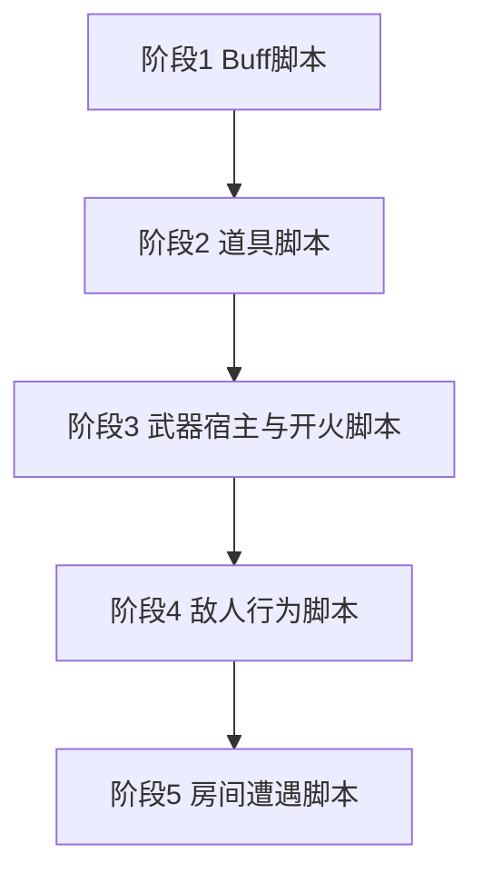

# Lua 玩法重写计划

玩法规则按「一条内容一份脚本」迁入 Lua。C# 继续持有生命周期、对象池、物理、动画、属性公式、存档和资源加载。不使用 xLua Hotfix，不注入 C# 方法，也不维护 `hotfix/main` 这条补丁链路。

## 顺序

1. Buff 特殊行为。宿主和热更分组已经可用，先把后续 Buff 全部落在这条链路上。
2. 道具效果。补齐 `CanUse` 后，按宝箱、净化、施加 Buff、治疗的顺序迁移。
3. 武器开火模式。先给 `Gun` 增加与 Buff 同型的脚本宿主，再迁行为差异大的枪。
4. 敌人行为。`EnemyBase` 保留受击、死亡和对象池，FSM 与攻击模式改由 Lua 驱动。
5. 房间遭遇规则。武器和敌人脚本稳定后，再迁清波之后的结算和少量房间进入规则。

阶段 1 和阶段 2 可以并行，因为 Buff 宿主与道具宿主已经分开。阶段 3 完成前不要改敌人的射击调用方式。阶段 4 完成前不要把房间清波规则改成脚本，否则生成、击杀计数和 AI 会同时变动。

## 脚本宿主

内容脚本返回一个 Lua table，C# 宿主在固定生命周期里调用其中的方法。玩法重写只走这条路。

| 内容 | 现状 | 程序集边界 |
| --- | --- | --- |
| Buff | `Buff.LuaFile` 返回 table，`LuaBuffInstance` 转发 `OnAdd`、`OnRemove`、`OnUpdate`、`OnInterval`、`OnTrigger` | `Game.Gameplay` 只依赖 `IBuffScriptInstance` 和 `BuffScriptRuntime`，`LuaManager` 在 `Game.Lua` 中注册工厂 |
| 道具 | `LuaEffect` 在 `OnPick` 时调用 `LuaManager.InvokeItemEffectMethod` | `LuaEffect` 位于 `Game.ItemEffects`，通过场景中的 `LuaManager` 进入 xLua |
| UI | 使用 [TCGGameDem0 `Lua` 分支](https://github.com/AChen1111/TCGGameDem0/tree/Lua) 的 `LuaComponet` | 界面物体必须挂 `LuaComponet`，由它按类型名创建模块实例并转发生命周期 |

`Game.Gameplay` 不能引用 `XLua.Runtime`。新增武器、敌人脚本时沿用 Buff 的分割：玩法程序集定义接口和注册点，`Assets/Scripts/Gameplay/Lua` 下的 `Game.Lua` 实现 Lua table 缓存和调用。界面逻辑不塞进 Buff 或道具的 table，单独走下面的 UI 框架。

## 职责切分

| 留在 C# | 迁入 Lua |
| --- | --- |
| 对象池 `OnSpawnFromPool` / `OnRecycleToPool` | 单条 Buff 的间隔伤害、触发表现 |
| `BuffManager` 的添加、移除、层数、持续时间 | 道具能否使用、使用后调用哪些已有 API |
| 属性公式 `Final = (Base + FlatSum) * (1 + PercentAddSum) * FinalMulProduct` | 武器按下、按住、抬起时的弹道和命中规则 |
| 武器读表、弹夹、备弹、音效、开火点、子弹池 | 敌人追击、攻击窗口、弹幕形状 |
| 敌人血量、受击、死亡、房间击杀通知、动画参数 | 清房后的额外结算，以及以后新增的遭遇规则 |
| `GameplayTime` 的敌人时间倍率 | 脚本内部使用宿主传入的 `EnemyDeltaTime` |
| 存档读写、安全点禁止战斗中存档 | 不迁 |
| Addressables 加载、数据库、伤害数字、DOTween | 不迁 |
| UI 栈的开关、暂停、层级 | 面板内部逻辑改由 `LuaComponet` 上的 Lua 模块处理 |

Lua 不直接改玩家移速、攻击或最大生命字段。常规属性继续写在 Buff 表的 `modifiers` 列，格式为 `StatType:ModifierType:Value`，由 `BuffManager.CalculateStat` 结算。`Defense` 仍只保留枚举，在伤害减免规则确定前不接入 `Player.Hurt`。

## UI 框架

界面脚本使用 [TCGGameDem0 的 `Lua` 分支](https://github.com/AChen1111/TCGGameDem0/tree/Lua)。入口在 `Assets/Scripts/LuaComponet` 与 `Assets/Scripts/LuaRaw`。类名是 `LuaComponet`。

要执行 Lua 界面逻辑的物体，必须在预制体或场景上挂 `LuaComponet`。没有这个组件的物体不会创建模块实例，也不会收到 `Awake`、`Start`、`OnEnable`、`OnDisable`、`OnDestroy`。不在运行时 `AddComponent` 补挂，也不靠代码生成一个带组件的空物体来代替预制体配置。

`LuaComponet` 的工作方式：

- `m_typeName` 是模块名，必须已经写进 `Assets/Scripts/LuaRaw/module.lua` 的 `moduleList`。`Main.Init` 按这个名字取出模块，建一张实例表，并把 `gameObject` 写到 `table.gameObject`。模块不存在时初始化失败并报错。
- `ObjectReference` 按 `name` 把场景引用注入实例表。`DataReference` 按 `name` 注入 `Int`、`Float`、`String`、`Bool`。注入发生在调用 Lua `Awake` 之前。Lua 字段名和 Inspector 里的 `name` 必须一致，例如 `BaseUI` 读取的 `m_Button`。
- 生命周期固定为 `Awake`、`Start`、`OnEnable`、`OnDisable`、`OnDestroy`。模块里没有对应函数时跳过，不补空实现。
- 其他界面方法通过 `LuaComponet.CallLuaFunction` 按名字转发，第一个参数是实例表。
- `require` 只写文件名，不写目录。`Assets/Scripts/LuaRaw/UI/BaseUI.lua` 对应 `require("BaseUI")`。编辑器从 `Assets/Scripts/LuaRaw` 读源码；真机从 `Resources/LuaBundle.bytes` 读字节码，打包入口是 `Tools/Lua/Build LuaBundle`。
- 框架自己的 `LuaManager`（`PersistentMonoSingleton<LuaManager>`，由 `Main.lua` 提供 `Init`）先于任何 `LuaComponet.Awake` 完成初始化，并放在场景里。它和当前 Buff 用的 `Game.Gameplay.LuaManager` 不是同一个类。不使用 `MonoSingleton` 在访问 `Instance` 时 `new GameObject` 再 `AddComponent` 的那条路径。

`UIStackManager` 继续负责 HUD 垫底、设置、胜利、失败面板的压栈，以及暂停时的 `Time.timeScale`。面板根物体在需要 Lua 逻辑时挂 `LuaComponet`，按钮、文本、图片引用通过 `ObjectReference` 注入，不再为同一块界面并行维护一套只存在于 Lua 里的显示数据。现有 `ComponentAutoBindTool` 前缀绑定继续服务仍由 C# 驱动的面板；改成 Lua 的面板以 `LuaComponet` 的引用注入为准。

## 阶段 1：Buff 特殊行为

### 现状

配置类是 `Assets/Scripts/Gameplay/Buffs/Buff/Buff.cs`，运行时状态是 `BuffRuntimeInfo`。`BuffManager.AddBuff` 通过 `BuffScriptRuntime.Factory` 创建脚本；非永久 Buff 重复添加会重置持续时间并再次 `OnAdd`，永久 Buff 重复添加会增加 `StackCount`。`Interval > 0` 时由 C# 计时并调用 `OnInterval`。

已有脚本：

| 文件 | 实际职责 |
| --- | --- |
| `SpeedBuff.lua.txt`、`DamageUpBuff.lua.txt`、`MaxHpUpBuff.lua.txt` | 生命周期为空，数值在 `Buff.Modifiers` |
| `PoisonBuff.lua.txt` | 间隔伤害，`PoisonDamagePerStack * StackCount`，调用 `owner:Hurt` |
| `HaHaBuff.lua.txt` | 间隔调用 `owner:ShowDisPlayer` |

脚本目录：`Assets/Scripts/Gameplay/Buffs/Buff`。热更分组：`Buff`，标签含 `buff` 与 `hot_update`。

### 这一阶段要做的事

- 新 Buff 只增加 Lua 文本和表数据，不新增 C# Buff 类。
- 只有特殊生命周期才写 Lua 逻辑。移速、攻击、最大生命继续用 `StatModifier`。
- 中毒一类效果以 `PoisonBuff` 为模板：伤害数值写在 Lua 常量或后续单独配置里，结算仍走 `Player.Hurt(DamageInfo)`，以保留受击反馈和死亡事件。
- 表现类效果以 `HaHaBuff` 为模板，通过玩家或事件中心的现有公开方法发消息，不在 Lua 里创建 UI 物体。
- 脚本方法缺失时保持 `LuaBuffInstance` 的当前行为：对应回调不调用。Lua 异常只记录日志，不中断 `BuffManager` 的添加和移除。

### 这一阶段不做的事

- 不重写 `BuffManager` 的层数、持续时间、标签净化。
- 不把 `CalculateStat` 搬进 Lua。
- 不把 `SpeedBuff`、`DamageUpBuff`、`MaxHpUpBuff` 里的空回调改成直接赋值玩家字段。

### 完成标准

- 新增一个间隔伤害 Buff 和一个纯属性 Buff，只改表与 Lua 文本即可在状态栏显示，并分别产生伤害或属性变化。
- 永久 Buff 叠层后，属性按层数放大，间隔伤害按 `StackCount` 放大。
- 净化仍调用 `BuffManager.RemoveBuffsByTag(BuffTag.Negative)`。

## 阶段 2：道具效果

### 现状

`ItemEffectBase` 位于 `Assets/Scripts/Items/ItemEffect/ItemEffectBase.cs`。`CanUse` 默认返回 `true`，`OnPick` 为抽象方法。背包在至少有一个效果 `CanUse` 为真时才消耗 1 个道具。

| 效果 | 文件 | 规则 |
| --- | --- | --- |
| 治疗 | `Assets/Scripts/ItemEffects/HealItemEffect.cs` | 满血不可用；否则 `Player.Heal`，并用头顶消息显示实际治疗量 |
| 施加 Buff | `Assets/Scripts/ItemEffects/ApplyBuffItemEffect.cs` | 解析 `buffId` 后 `BuffManager.AddBuff` |
| 净化 | `Assets/Scripts/ItemEffects/CleanseNegativeBuffItemEffect.cs` | 没有负面 Buff 时不可用；否则 `RemoveBuffsByTag(BuffTag.Negative)` |
| 宝箱随机掉落 | `Assets/Scripts/Items/ItemEffect/ChestRandomLootEffect.cs` | 从 `ItemSpawnTableSO` 取预制体，经 `ItemSpawner` 生成 |
| Lua 效果 | `Assets/Scripts/ItemEffects/LuaEffect.cs` | 只转发 `OnPick` |

已有 Lua：`Assets/Scripts/ItemEffects/Lua/HelloItemEffect.lua.txt`、`ChestEffect.lua.txt`。`ChestEffect` 直接取 `ItemSpawner.SpawnItem`，还没有接上 `CanUse`。

`LuaManager.GetItemEffectMethod` 使用 `table.Get<Action<ItemEffectContext>>`。方法不存在时会在取委托阶段失败，因此新契约必须在宿主里显式判断方法是否存在，不能假定每份旧脚本都有 `CanUse`。

### 宿主改造

`LuaEffect` 增加 `CanUse`：

- Lua table 存在 `CanUse` 时调用它，返回值决定是否允许消耗。
- Lua table 没有 `CanUse` 时与 `ItemEffectBase` 默认一致，返回 `true`。`HelloItemEffect` 因此不必为了兼容去补空方法；新脚本如果有使用条件，必须实现 `CanUse`。
- `OnPick` 继续必填。缺失时按现有加载失败方式报错。
- 治疗量、BuffId、是否显示头顶消息仍放在 `LuaEffect` 的序列化字段或独立配置里，由 `ItemEffectContext` 扩展后传入。不把这些数值只写死在脚本常量里，否则表导入和预制体配置会失效。

`ItemEffectContext` 现有字段只有 `SourceObject` 和 `WorldPosition`。迁治疗和施加 Buff 之前，上下文需要能拿到配置数值。扩展字段保持 C# 结构体，由 `LuaEffect` 填入，Lua 只读取。

### 迁移顺序

1. `ChestEffect` 与 `ChestRandomLootEffect` 对齐：生成表、随机偏移、弹出动画仍由 C# `ItemSpawner` 执行，Lua 决定是否生成以及调用哪一次 `SpawnItem`。`CanUse` 对应现在的「有生成器且掉落表非空」。
2. 净化。Lua 调用 `RemoveBuffsByTag`，`CanUse` 检查 `ActiveBuffs` 中是否存在 `BuffTag.Negative`。
3. 施加 Buff。Lua 调用 `BuffManager.AddBuff`，Buff 本体仍来自 `BuffDataBase`。
4. 治疗。Lua 调用 `Player.Heal` 和 `CoreEvents.PlayerHeadMessageRequested`。满血判断使用 `Player.IsHPFull`。

背包堆叠、拾取动画、对象池释放和 `ItemEvents.InventoryChanged` 留在 `Item` 与 `PlayerInventory`。

### 完成标准

- 右键使用时，满血治疗和没有负面状态的净化都不消耗道具。
- 宝箱效果仍通过 `ItemSpawner` 出物品，不在 Lua 里 `Instantiate`。
- 道具 Lua 文本进入 `Item` 热更分组，并带 `hot_update` 标签。

## 阶段 3：武器开火模式

### 现状

`Gun` 在 `Awake` 时用 `WeaponDatabase` 填充音效、伤害、弹夹、射速和弹速。`ShootDown`、`Shooting`、`ShootUp`、`Shoot`、`Reload` 是开火生命周期。子弹通过受保护的 `GetBullet` 从 `PlayerBulletPool` 取出。玩家固定按地址装载 `weapon/pistol`、`weapon/ak`、`weapon/awp`、`weapon/bow`、`weapon/laser`、`weapon/mp5`、`weapon/rocket_gun`、`weapon/shotgun`。

各枪当前差异：

| 枪 | 行为 | 迁移批次 |
| --- | --- | --- |
| `ShotGun` | 一次按下发射 5 发，左右各按 2 度展开 | 第一批 |
| `Laser` | 按下开启 `LineRenderer`，按住射线检测 `Wall` 与 `EnemyLayer`，按 `shootInterval` 对父级 `EnemyBase` 调用 `Hurt`；`BulletBag` 为无限 | 第一批 |
| `Bow` | 按住累计时间，超过 0.5 秒显示箭矢并在抬起时发射；`BulletBag` 为无限 | 第一批 |
| `RocketGun` | 按下和按住都走单发 `Shoot`，子弹朝向改为 `dir` | 第一批 |
| `AWP` | 与火箭筒相同的单发节流，没有额外弹道 | 第一批里最后迁，用来确认宿主能表达「没有特殊规则」 |
| `AK` | 按住循环音效，按间隔发射，抬起播放结束音 | 第二批 |
| `MP5` | 与 AK 相同，抬起时停止音效 | 第二批 |
| `Pistol` | 按下打一发 | 第二批，作为默认点射模板 |

AK、MP5、手枪的差异主要是音效循环，不是弹道。它们留到宿主和第一批特殊枪稳定之后，避免一开始就复制三份相同脚本。

### 宿主形状

在 `Game.Gameplay` 增加武器脚本抽象，在 `Game.Lua` 增加对应实例，注册方式对齐 `BuffScriptRuntime`：

- `IWeaponScriptInstance` 提供 `ShootDown`、`Shooting`、`ShootUp`。
- `Gun` 在这些虚方法里转发给脚本。脚本缺失时保留该枪现有的 C# 实现，直到该枪迁移完成并删掉旧实现。
- 弹药检查、`GunClip.Shoot`、`ShootDuration`、`Reload`、`GetBullet`、`PlayGunFire`、`TryPlaySound` 仍由 `Gun` 的公开方法提供给 Lua。迁移前先把 Lua 需要的成员从 `protected` 收成明确的公开方法，例如尝试消耗一发并返回是否可射击、按方向生成子弹、播放枪口与音效。
- 激光的 `LineRenderer`、弓的箭矢 `SpriteRenderer` 继续挂在预制体上，由该枪的 C# 组件暴露给脚本。Lua 不创建这些组件。
- 伤害随机、弹速、射速继续来自 `WeaponData.ApplyTo`。散射角度、激光距离、弓的蓄力阈值属于规则，第一批可以写在对应 Lua 内；若以后要进表，再给 `WeaponData` 加字段，不在第一次迁移里扩展表结构。

武器脚本目录放在 `Assets/Scripts/Gameplay/Entity/Player/Weapon` 下的独立 Lua 文件夹，Addressables 分组使用已有的 `Weapon`，并带 `hot_update`。

### 完成标准

- 散弹、激光、弓、火箭筒的手感与迁移前一致：弹数、角度、蓄力 0.5 秒、射线层和无限备弹保持不变。
- 换弹、弹尽头顶提示、切枪时 `GameplayEvents.BulletBagChanged` 仍由 C# 发出。
- 未迁移的 AK、MP5、手枪仍走原来的 C# 方法。

## 阶段 4：敌人行为

### 现状

`EnemyBase` 要求子类实现 `OnInit`、`WeaponType` 和 `RegisterFSM`。状态枚举目前只有 `EnemyState.Follow` 与 `EnemyState.Attack`。对象池复用时 `OnSpawnFromPool` 会重置并再次 `Init`。受击、死亡、掉落和 `FightRoom.NotifyEnemyDefeated` 在基类。计时必须使用 `GameplayTime.EnemyDeltaTime`，动画速度由基类按 `EnemyTimeScale` 缩放。

| 敌人 | 行为 |
| --- | --- |
| `EnemyA` | 追击 `followDuration` 后进入攻击，攻击窗内按 `shootInterval` 向玩家发射 |
| `EnemyBat` | 追击后停步，延迟 `attackShootDelay` 发射扇形弹，再锁定到 `attackLockDuration` |
| `EnemyMelee` | 前方 `MeleeAttackDetector` 碰到玩家后进入攻击窗，冷却由 `attackCooldown` 控制 |
| `EnemyBig` | 在环形弹幕和追踪点射之间循环，持续时间与子弹数量都在预制体字段上 |

`EnemyBig` 与其他敌人一样走行为脚本宿主。

### 宿主形状

- `EnemyBase` 保留血量、受击闪白、死亡回收、掉落、房间归属和动画参数名。
- 新增 `IEnemyBehaviorScript`，由 `OnSpawn`、`OnUpdate(enemyDeltaTime)`、`OnRecycle` 组成。`OnRecycle` 必须清掉 Lua 侧计时和攻击标记，因为对象池不会再次调用 `Start`。
- C# 向 Lua 提供移动、停止、朝向翻转、播放攻击动画、生成敌人子弹这些方法。子弹仍来自 `EnemyBulletPool`。
- 近战检测器 `MeleeAttackDetector` 留在预制体上。Lua 只读取「当前是否命中玩家」和调用已有的伤害入口。
- 追击时长、攻击窗、扇形角度、环形弹数量第一批写在该敌人的 Lua 中，数值含义与现在的序列化字段一致。预制体上的旧字段保留到对应脚本上线并核对手感之后再删，避免场景和预制体引用突然失效。
- `EnemyDatabase` 继续提供生命、移速、伤害和掉落概率。`ApplyConfig` 留在 C#。

脚本目录放在 `Assets/Scripts/Gameplay/Entity/Enemy` 下的 Lua 文件夹，分组使用 `Enemy`，标签包含 `enemy` 与 `hot_update`。

迁移顺序：`EnemyA`、`EnemyBat`、`EnemyMelee`、`EnemyBig`。`EnemyA` 用来打通生成子弹和局部时间；蝙蝠验证扇形弹；近战验证检测器；大型敌人验证多阶段计时。

### 完成标准

- 子弹时间只拖慢敌人移动、攻击计时、敌人子弹和敌人动画，玩家射击不受影响。
- 敌人死亡后仍通知 `FightRoom`，对象池复用后不会沿用上一次的攻击计时或房间引用。
- 四类敌人的弹数、延迟和冷却与迁移前的预制体配置一致。

## 阶段 5：房间遭遇规则

### 现状

`FightRoom` 负责进房关门、按波生成、击杀减计数、清完开门，并发出 `GameplayEvents.RoomWaveDisplayChanged`。战斗中 `currentFightRoom` 非空，安全点存档必须失败。`NormalRoom` 的波次和敌人数量来自 `EnemySpawnTableSO`，出生点是房间里的 `Transform` 列表。

其他房间：

| 房间 | 规则 | 是否进入本阶段 |
| --- | --- | --- |
| `NormalRoom` | 按生成表刷怪 | 生成表保持 ScriptableObject；只有额外遭遇规则才写 Lua |
| `ChestRoom` | 玩家进入时在点位 `SpawnItem`，离开后标记完成 | 可以迁进入规则 |
| `SpawnPrefabFightRoomEndEffectSO` | 清房后按生成表在房间中心生成预制体 | 与宝箱效果一起迁 |
| `InitRoom` | 放置玩家出生点 | 不迁 |
| `FinalRoom` | 进入后显示贴图，读档按 `visited` 恢复 | 不迁 |
| `SaveRoom` | 当前几乎为空，安全点规则在存档服务 | 不迁 |
| `AddressableDungeonBootstrapper` | 加载 `room/level1` 并调用 Edgar `Generate` | 不迁 |

### 这一阶段要做的事

- `FightRoom` 继续持有波数、敌人数、门和 `currentFightRoom`。
- 生成表、出生点、读档时「已清空房间不再刷怪」留在 C#。
- 清房回调 `OnFightAllWavesEnd` 可以转发给房间脚本，用于额外奖励。奖励生成仍调用 `ItemSpawner`。
- `ChestRoom` 的进入生成可以改为房间脚本，完成标记和读档字段仍由房间组件保存。

### 完成标准

- 战斗中存档仍然失败。
- 已清空房间读档后不会再次刷怪或再次结算掉落。
- 波数 UI 仍只消费 `RoomWaveDisplayEvent`。

## 不进入重写的部分

这些部分保持 C# 实现，不用 Lua 替换，也不使用 xLua Hotfix 替换方法体。

- `Player`：移动、睡眠动画、自动瞄准、受击、治疗、武器异步装载、读档恢复。鼠标战斗仍先检查 `GameplayCursorState.BlocksMouseCombat`。
- `PlayerBullet`：飞行和命中。
- `SaveGameService`、`SaveDataBuilder`、`SaveDataRestorer`：3 个 JSON 槽、读档重载 `GameScene`、不保存地面掉落。
- `BuffManager` 的属性结算和 Buff 容器。
- `GameplayTime`：只写敌人时间倍率，不改 `Time.timeScale`。
- 对象池、`AddressableLoader`、`DataBaseManager`、小地图、镜头、伤害数字和 DOTween。
- UI 栈本身的压栈、暂停和鼠标占用。面板内部逻辑另走 `LuaComponet`。

## 每个阶段的共同约束

- 新 C# 文件使用中文注释，注释为中文描述加英文标点。
- 缺少 `LuaManager`、数据库、预制体引用或 Lua 返回值时直接报错，不另做一套静默兜底。
- 不在代码里 `new GameObject` 来创建管理器。`LuaManager` 继续只放在 `Root`。
- 玩法程序集通过接口和静态注册点调用脚本。具体 `LuaTable` 类型只出现在 `Game.Lua`。
- 新脚本放进对应模块目录，并进入已有 Addressables 分组 `Buff`、`Item`、`Weapon`、`Enemy`、`Room`。启动预下载条目带 `hot_update`。
- 对象池对象的脚本状态在 `OnRecycle` 清理。
- 敌人脚本的时间参数使用宿主传入的敌人局部时间。
- 每增加一类脚本宿主，把目录、职责和公开接口补进 `SKILL.md` 与 `references/project-architecture.md`。
- 不新增 `Hotfix` 特性，不执行 `XLua/Hotfix Inject In Editor`，不把玩法类型写进热修注入列表。
- 改成 Lua 的界面物体在预制体上挂 `LuaComponet`，`m_typeName` 与 `moduleList` 中的名字一致，引用字段名与 `ObjectReference.name` 一致。

## 验收顺序

1. 纯属性 Buff 与中毒 Buff 同时存在时，属性走公式，中毒走 `Hurt`。
2. 治疗、净化、施加 Buff、宝箱四种道具在背包中的消耗条件与迁移前一致。
3. 第一批四把特殊枪在训练房里完成按下、按住、抬起，弹药 UI 与音效不回归。
4. 四类敌人在子弹时间下完成追击、攻击和死亡回收，房间波次能正常结束。
5. 清房奖励和宝箱房生成成功，战斗中 `F5` 安全点存档失败，清空后的房间读档不再刷怪。
