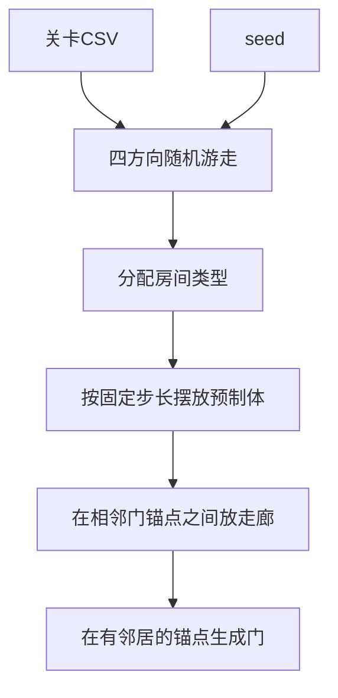

# 随机房间生成方案

房间仍然是预制体，墙画在预制体的 Tilemap 里。生成器只决定有几间房、怎么连、摆在哪。不重做 Edgar 那套关卡图加约束求解，也不在运行时挖瓦片。

现有入口是 `Assets/Scripts/Gameplay/Room/HotUpdate/AddressableDungeonBootstrapper.cs`：加载 `room/level1` 的 `LevelGraph`，再调用 `DungeonGeneratorGrid2D.Generate()`。门的位置来自 Edgar 的 `RoomInfoGrid2D`，见 `Assets/Scripts/Gameplay/Room/RoomBase/Room.cs` 的 `GetDoorSpawnPositionsFromEdgar()`。走廊预制体是 `Assets/Prefab/Room/CorridorTemplate/LRCorridor.prefab` 和 `UDCorridor.prefab`。

## 关卡配置

房间数量、类型数量和预制体都来自 CSV，不写在生成器字段里。表文件是 `Assets/csv/LevelConfig.csv`，与现有物品、武器、Buff、敌人表放在一起。一行一个关卡。生成前按 `levelId` 读取；缺行、数量对不上、预制体地址为空时直接失败。

列：

- `levelId`：关卡 id。当前第一关对应现在的 `room/level1`。
- `roomCount`：房间总数。
- `initCount`、`finalCount`、`chestCount`、`saveCount`：这四类的数量。`initCount` 和 `finalCount` 必须是 1。
- `normalCount`：普通战斗房数量。五类数量之和必须等于 `roomCount`。
- `initPrefab`、`finalPrefab`、`chestPrefab`、`savePrefab`、`normalPrefabs`：Addressables 地址。`normalPrefabs` 用分号分隔多个普通房预制体。

种子不写进表。开局新种子或读档种子只决定游走顺序和从 `normalPrefabs` 里抽哪一间。同一关卡配置加同一颗种子，地图必须相同。

## 算法

使用带种子的四方向随机游走，结果天然是一棵连通树。游走长度、类型数量都读上面的关卡行。

1. 用存档或开局传入的 `seed` 创建 `System.Random`。全程只用这一个随机源。
2. 把 `(0,0)` 放进已占用格子，作为起点。
3. 从当前格子的上下左右里选一个空邻居并走过去。四个方向都占满时，退回到已经生成的某一间再继续走。
4. 走到该关卡的 `roomCount` 后停止。数量不够就直接报错，不偷偷少生成。
5. 按该关卡的数量分配类型：`(0,0)` 是 `InitRoom`；曼哈顿距离最远的一间是 `FinalRoom`；优先从死胡同里按 `chestCount`、`saveCount` 抽取宝箱房和存档房，死胡同不够再从其余非起点、非终点房间补足。补完仍不够就报错。剩下的房间数量必须等于 `normalCount`。
6. 预制体地址来自该关卡行，不再写死 `Assets/Prefab/Room/RoomTemplate` 里的文件名。普通房按种子从 `normalPrefabs` 抽取。

同一颗种子必须得到同一张图。读档时继续重载 `GameScene`，把种子传回生成器，替代现在保存的 Edgar `LevelGraph` 地址加 Edgar seed。

## 房间、墙、门怎么建模

- 房间是现有预制体。`Floor` 和 `Walls` 两张 Tilemap 留在预制体里，生成器不改墙。`NormalRoom` 的墙大约是 13 乘 10 格。
- 每个房间预制体增加四个空物体锚点：`DoorAnchor_N`、`DoorAnchor_E`、`DoorAnchor_S`、`DoorAnchor_W`，放在对应墙边的门口中心。没有锚点就报错。
- 逻辑房间是一个格子坐标加四个邻居。只有图上相连的边才开门。
- 门继续用 `Assets/Prefab/Door/Door.prefab`。`Room.InitRoom()` 改为按邻居列表在对应锚点实例化门，不再读 `RoomInfoGrid2D`。开关门仍由 `FightRoom` 负责。
- 存档房间 id 改为 `类型_格子X_格子Y`，不再依赖 Edgar 的 `RoomInstance.Position`。

## 走廊怎么拼

只连接上下左右相邻的房间，所以走廊永远是直线，不会出现 L 形。

格子步长固定，让现有走廊预制体能一次放进去，不缩放：

- 水平步长 = 房间外框宽度 + `LRCorridor` 的长度。
- 垂直步长 = 房间外框高度 + `UDCorridor` 的长度。

房间 `(x, y)` 的世界坐标是 `(x * 水平步长, y * 垂直步长)`。两个房间的门锚点之间正好空出一条走廊。

拼接步骤：

1. 水平邻居实例化 `LRCorridor`，垂直邻居实例化 `UDCorridor`。
2. 把走廊中心放在两个门锚点的中点，朝向沿连线。
3. 走廊两端对齐两边的 `DoorAnchor`。门单独放在锚点上，不做到走廊预制体里。
4. 若实测预制体长度和步长对不齐，先改步长常量，不用 Tilemap 拉伸。

## 代码落点

新代码放在 `Assets/Scripts/Gameplay/Room/Generation`，由场景里的组件驱动，不在代码里创建管理器。

- `RoomGraph`：格子、类型、四个邻居。
- `RandomRoomGenerator`：读取 `Assets/csv/LevelConfig.csv` 的关卡行，再游走、摆房间、摆走廊、把门锚点交给 `Room`。
- `GameScene` 上用它替换 `AddressableDungeonBootstrapper` 里的 `dungeonGenerator.Generate()`。Edgar 组件先留在工程里，这条生成路径不再调用它。
- 小地图不再走 `MinimapHighlightPostProcess` 的 Edgar 回调，改为用每个房间 `Floor` Tilemap 的格子填 `MinimapRoomData`。

`FightRoom` 的波次、关门、安全点禁止战斗中存档保持不变。生成器只决定房间类型和位置。
