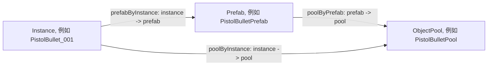
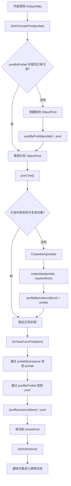
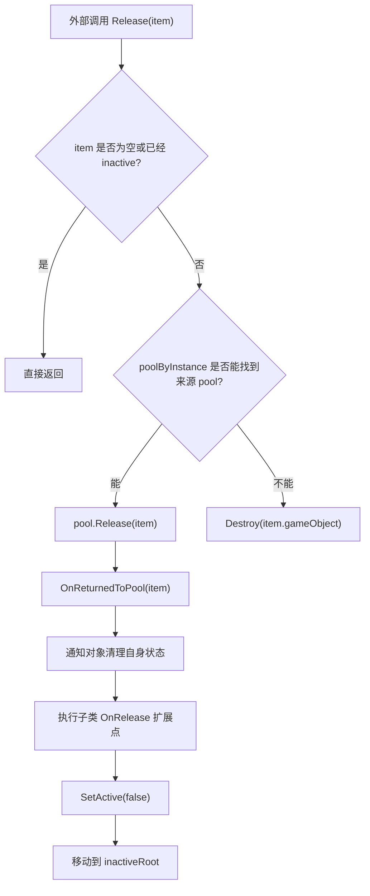
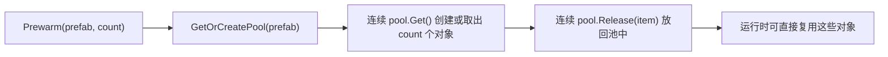

# PoolBase 对象池基类说明

`PoolBase<T>` 是项目里的通用对象池基类. 它基于 Unity 自带的 `ObjectPool<T>` 做了一层封装, 让一个池组件可以同时管理多个 prefab 对应的子池.

典型使用场景:

- 玩家子弹池: 不同武器可以使用不同子弹 prefab, 但统一由 `PlayerBulletPool` 管理.
- 敌人池: 不同敌人 prefab 可以共用一个敌人池基类.
- 特效池: 不同 VFX prefab 可以按 prefab 自动拆分子池.

泛型约束如下:

```csharp
public abstract class PoolBase<T> : MonoBehaviour where T : MonoBehaviour, IPoolable
```

这表示被对象池管理的对象必须同时满足两个条件:

- 必须是 `MonoBehaviour`, 因为对象需要挂在 GameObject 上, 并且需要被 `Instantiate`, `SetActive`, `Destroy` 等 Unity API 管理.
- 必须实现 `IPoolable`, 因为对象池需要在取出和回收时通知对象重置或清理自身状态.

`IPoolable` 的职责很小:

```csharp
public interface IPoolable
{
    void OnSpawnFromPool();
    void OnRecycleToPool();
}
```

对象池负责生命周期调度, 具体对象负责自己的状态重置.

## 核心设计

`PoolBase<T>` 不是只管理一个 `ObjectPool<T>`, 而是按 prefab 管理多个 `ObjectPool<T>`.

这样做的原因是: 同一种逻辑类型可能有多个 prefab. 例如玩家子弹都是 `PlayerBullet`, 但手枪子弹, 火箭弹, 弓箭可能是不同 prefab. 如果所有实例都放进同一个 `ObjectPool<T>`, 下一次取出时可能拿到错误外观或错误配置的对象.

所以这个类的核心目标是:

> 同一个 `PoolBase<T>` 管理同一类对象, 但不同 prefab 的实例必须回到自己的子池.

## 三个字典的职责

`PoolBase<T>` 最重要的是这三个字典:

```csharp
private readonly Dictionary<T, ObjectPool<T>> poolByPrefab = new Dictionary<T, ObjectPool<T>>();
private readonly Dictionary<T, ObjectPool<T>> poolByInstance = new Dictionary<T, ObjectPool<T>>();
private readonly Dictionary<T, T> prefabByInstance = new Dictionary<T, T>();
```

它们分别回答三个不同的问题.

### 1. poolByPrefab

```csharp
Dictionary<T, ObjectPool<T>> poolByPrefab
```

职责:

> 根据 prefab 找到它对应的 `ObjectPool<T>`.

映射关系:

```text
prefab -> ObjectPool
```

例子:

```text
PistolBulletPrefab -> PistolBulletPool
RocketBulletPrefab -> RocketBulletPool
ArrowBulletPrefab -> ArrowBulletPool
```

它主要在 `GetOrCreatePool(prefab)` 中使用.

当外部调用:

```csharp
Get(pistolBulletPrefab)
```

对象池会先查 `poolByPrefab`:

- 如果这个 prefab 已经有子池, 直接使用已有子池.
- 如果这个 prefab 还没有子池, 创建一个新的 `ObjectPool<T>`, 然后登记到 `poolByPrefab`.

所以 `poolByPrefab` 解决的是:

> 这个 prefab 应该从哪个子池取对象?

### 2. poolByInstance

```csharp
Dictionary<T, ObjectPool<T>> poolByInstance
```

职责:

> 根据已经实例化出来的对象, 找到它所属的 `ObjectPool<T>`.

映射关系:

```text
instance -> ObjectPool
```

例子:

```text
PistolBullet_001 -> PistolBulletPool
PistolBullet_002 -> PistolBulletPool
RocketBullet_001 -> RocketBulletPool
```

它主要在 `Release(item)` 中使用.

回收对象时, 调用方通常只有实例:

```csharp
PlayerBulletPool.Instance.Release(this);
```

调用方不应该还要传入 prefab, 否则每个对象都要记住自己来自哪个 prefab, 职责会变乱.

所以 `Release(item)` 会通过 `poolByInstance` 反查:

```csharp
if(poolByInstance.TryGetValue(item, out var pool)) {
    pool.Release(item);
    return;
}
```

这样可以保证:

- 手枪子弹实例回到手枪子弹子池.
- 火箭弹实例回到火箭弹子池.
- 弓箭实例回到弓箭子池.

所以 `poolByInstance` 解决的是:

> 这个已经取出的实例应该归还到哪个子池?

### 3. prefabByInstance

```csharp
Dictionary<T, T> prefabByInstance
```

职责:

> 根据实例找到它来源的 prefab.

映射关系:

```text
instance -> prefab
```

例子:

```text
PistolBullet_001 -> PistolBulletPrefab
RocketBullet_001 -> RocketBulletPrefab
ArrowBullet_001 -> ArrowBulletPrefab
```

这个字典在 `CreateItem(prefab)` 中建立:

```csharp
var item = Instantiate(prefab, inactiveRoot);
prefabByInstance[item] = prefab;
```

它的意义是保存实例和 prefab 的永久来源关系. 一个实例从创建开始, 它属于哪个 prefab 就不会再变.

为什么已经有 `poolByInstance` 了, 还需要 `prefabByInstance`?

因为 `poolByInstance` 是运行期回收用的直接映射, 而 `prefabByInstance` 是实例来源记录.

在对象从池中取出时, 当前实现会根据 `prefabByInstance` 恢复 `poolByInstance`:

```csharp
if(prefabByInstance.TryGetValue(item, out var prefab) && poolByPrefab.TryGetValue(prefab, out var pool)) {
    poolByInstance[item] = pool;
}
```

这说明 `prefabByInstance` 更像是一份来源档案:

> 只要知道实例来自哪个 prefab, 就永远可以重新找到它对应的子池.

所以 `prefabByInstance` 解决的是:

> 这个实例最初是由哪个 prefab 创建出来的?

## 三个字典的关系图



可以理解成:

- `poolByPrefab` 用于取对象.
- `poolByInstance` 用于还对象.
- `prefabByInstance` 用于记录实例的来源.

## 生命周期总览



## 取出对象流程

外部获取对象有两种常见方式.

使用默认 prefab:

```csharp
var item = pool.Get();
```

使用指定 prefab:

```csharp
var item = pool.Get(prefab);
```

如果需要顺便设置位置和旋转:

```csharp
var item = pool.Get(prefab, position, rotation);
```

内部主要流程是:

1. 检查 prefab 是否为空.
2. 使用 `GetOrCreatePool(prefab)` 找到对应子池.
3. 如果子池不存在, 创建一个新的 `ObjectPool<T>`.
4. 调用 `ObjectPool<T>.Get()`.
5. 如果池中没有空闲实例, 通过 `CreateItem(prefab)` 创建新实例.
6. 取出实例后, 将它移动到 `activeRoot`.
7. 激活 GameObject.
8. 通知对象执行取出时的状态重置.

## 回收对象流程



回收时调用方只需要传入实例:

```csharp
pool.Release(item);
```

它不需要知道这个实例来自哪个 prefab.

`PoolBase<T>` 会通过:

```csharp
poolByInstance[item]
```

找到正确的子池并归还.

如果实例没有登记在 `poolByInstance` 中, 当前实现会认为它不是由这个池创建的对象, 然后直接销毁:

```csharp
Destroy(item.gameObject);
```

## 预热流程

预热用于提前创建对象, 减少游戏过程中第一次创建对象带来的卡顿.

调用:

```csharp
Prewarm(prefab, count);
```

内部流程:

1. 找到或创建 prefab 对应的子池.
2. 连续 `Get()` 出 `count` 个对象.
3. 再把这些对象全部 `Release()` 回池中.

这样做以后, 子池中就提前准备好了可复用实例.



## 层级管理

对象池会维护两个 Transform:

```csharp
activeRoot
inactiveRoot
```

职责:

- `activeRoot`: 存放当前正在使用的对象.
- `inactiveRoot`: 存放已经回收到池中的对象.

如果没有在 Inspector 中手动指定, `EnsureRoots()` 会自动创建:

```text
Pool GameObject
├── Active
└── Inactive
```

这样做的好处是:

- Hierarchy 更清晰.
- 运行时可以直接观察哪些对象正在使用.
- 回收对象和激活对象不会混在一起.

## 可覆写扩展点

`PoolBase<T>` 提供了四个可覆写方法, 子类可以按需扩展.

### OnCreate

```csharp
protected virtual void OnCreate(T item, T prefab)
```

调用时机:

> 实例第一次由 prefab 创建出来之后.

适合做:

- 一次性组件缓存.
- 初始化对象和池之间的关系.
- 设置只需要做一次的数据.

### OnGet

```csharp
protected virtual void OnGet(T item)
```

调用时机:

> 对象被取出, 移动到 `activeRoot`, 并激活之后.

适合做:

- 池层面的取出逻辑.
- 订阅由池负责管理的事件.
- 设置和池相关的运行时数据.

对象自身状态重置更适合放在 `IPoolable.OnSpawnFromPool()`.

### OnRelease

```csharp
protected virtual void OnRelease(T item)
```

调用时机:

> 对象执行 `OnRecycleToPool()` 之后, `SetActive(false)` 之前.

适合做:

- 取消事件订阅.
- 清理池层面的状态.
- 处理和具体子类池相关的回收逻辑.

对象自身状态清理更适合放在 `IPoolable.OnRecycleToPool()`.

### OnDestroyItem

```csharp
protected virtual void OnDestroyItem(T item)
```

调用时机:

> `ObjectPool<T>` 决定真正销毁实例之前.

适合做:

- 释放额外资源.
- 清理外部注册.
- 处理不能只靠 `Destroy(gameObject)` 完成的销毁逻辑.

## 当前实现需要注意的点

当前代码中 `OnTakeFromPool` 的意图是通知对象已经从池中取出. 从接口命名上看, 这里更符合 `OnSpawnFromPool()` 的职责.

也就是说, 理想调用应该是:

```csharp
item.OnSpawnFromPool();
```

如果取出阶段误调用 `OnRecycleToPool()`, 对象会在刚激活时执行回收清理逻辑, 可能导致状态被错误重置.

## 总结

`PoolBase<T>` 的核心不是简单缓存对象, 而是解决 "同一种组件类型, 多个 prefab, 多个子池" 的映射问题.

三个字典的分工是整个设计的关键:

- `poolByPrefab`: prefab -> pool, 解决从哪个子池取对象.
- `poolByInstance`: instance -> pool, 解决把实例还到哪个子池.
- `prefabByInstance`: instance -> prefab, 记录实例来源, 用于恢复实例和子池的关系.

只要理解这三个映射, 就能理解整个对象池基类的运行方式.
